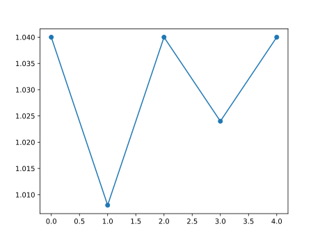
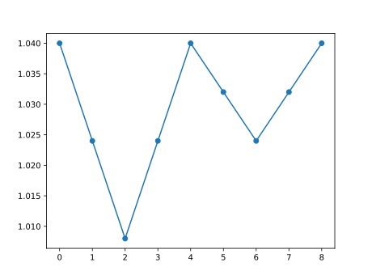

# Technical Analysis Chart Pattern Research
An investigation to see if technical analysis involving chart patterns truly is just male astrology.

## Overview
There is a field of study/methodology within finance called Technical Analysis (TA). TA focuses on analysing a security's price movement and volume with various tools such as chart patterns, momentum indicators, moving averages and support/resistance levels. 

People that vouch for TA say that it allows one to predict price action of a security within the short/medium term. There are also plenty of people against the use of TA saying that it is literally male astrology and should only be used by people with room temperature IQ. I wanted to see which side was right.

## Introduction
Due to the extreme scope of TA, I decided to **only focus on** one subset of TA: **Chart patterns**. This would naturally place a dampener on the conclusions of my final results as TA involves looking at many bullish/bearish signals at once. However, by the time I were to account for every single TA technique, I would much rather be huffing car exhaust fumes.

## Chart pattern assumptions
 - Chart pattern recognition only involves using pricing data from market sessions and pre/post market sessions. Therefore any time periods between these market sessions can be outright ignored.

 - Only these chart patterns will be looked out for:
   - Symmetric triangle (bullish and bearish variants)
   - Ascending triangle
   - Descending triangle
   - Rising wedge
   - Falling wedge
   - Rectanglle (bullish and bearish variants)

 - Patterns focus more on the relative "shape" of a price movement. The price or time scales that the pattern occurs over should have no effect on its predictive power.

## Data used
5 minute intraday stock data for the top 107 weighted companies in the S&P 500 was used for the investigation. Data was provided by Alpha Vantage's API.

## General methodology
 1. Import data
 2. Filter for the opening price of each timestep
 4. Choose a pattern to find
 5. Find where the pattern occurs within the data
 6. Record the price movement that occur after the pattern occurance.
 7. Plot and overlay all of the price movements together and draw conclusions

## General pattern recognition procedure
 1. Perform log (base e) on all pricing data and the target pattern sequence.
 2. Create a rolling view on the pricing data. Length of the view being equal to the length of the pattern sequence.
 3. Perform (what I call) "initial differencing" onto all the views and the pattern sequence.
    
    Initial differencing: When all the values of a sequence is subtracted by the first value of the sequence. E.g [3, 5, 2, 12, -6, 8, 3] -> [0, 2, -1, 9, -9, 5, 0]
 4. Compare the pattern sequence with each view.
 5. Filter out views deviate too much from the pattern sequence.
 6. Record the timestamps of the views that are left.

## Horizontal scaling
From the [list of assumptions](#chart-pattern-assumptions), the time scale a pattern occurs over should not impact the prediction of the future price action. Due to this, within the pattern recognition code, the target sequence can be warped "horizontally" before any rolling views are generated.

### Example
#### Ascending Triangle pattern at base scale (5 values)

#### Ascending Triangle pattern at 2x scale (9 values)

### Implementation details
 - Scaling occurs with the number of segments in a sequence, **not the number of values**. From the example, we see that a 2x scale did not double the number of values.
   - This was done so that the scaling has absolutely no impact on the original "shape" of the sequence.
 - The change between pairs of values is assumed to be linear.

## Explaining Results
### Image generation procedure
1. Apply a scale factor to sequence pattern
2. Perform pattern recognition
3. For each timestep where pattern occurs, record the future sequence of values. (Number of values recorded is proportional to scaling in step 1)
4. Do steps 1 to 3 for all scales given by the user
5. Apply scaling to all sequences recorded so that they can be overlayed on top of each other when plotting
6. Plot all sequences recorded and other relevant info

### Scalings used
Two sets of [scales](#horizontal-scaling) were used seperately when performing the pattern matching:
 - "Short term" - scale factors of [2, 4, 6, 8, 10]
 - "Long term" - scale factors of [20, 30, 40, 50, 60]

### Accepted error
Accepted error was adjusted by hand so that it would be either:
 - Low enough so that the average sorta matches the target pattern or
 - Low as possible without purging too many views

### Patterns searched for
The patterns stated in [chart pattern assumptions](#chart-pattern-assumptions) were only looked out for. However, the implementation/values of these patterns were chosen by hand. Differing time scales for these patterns were accounted for ([see scalings used](#scalings-used)) however differing vertical scales were ignored ([see limitations](#limitations-and-oversights)).

## Results
All result images can be found in "/results" directory. Here are a few however:
### Long term scale
 - Symmtric triangle (bullish variant)
   
 - Symmtric triangle (bearish variant)
   
 - Rectangle (bullish variant)
   

### Short term scale
 - Ascending triangle
   
 - Descending triangle
   

## Conclusions
For almost all of the patterns covered here, the average returns line was flat. And thus to absolutely no one's surprise, with the chart patterns and data covered here, there is no indication that a chart pattern could be used to predict future price action.

However the long term scale rectangle (bearish variant) was an exception??:

## Limitations and Oversights
### Representation
 - The vertical scale differs from image to image. Next time round probably set matplotlib a default scale to work with.
 - Would have been more intuitive to display "Percentage returns from step 0" instead of log returns.
### Data
 - Intraday data only went back 2 years (to 2020).
 - Only focused on American equities.
 - So many more equities could be included...
 - Only used a single source of data (Alpha Vantage).
### Pattern recognition/analysis
 - Method used does not emulate the procedure used by humans to identify a chart pattern. Human recognition of chart patterns is done by looking at the level/slope of support/resistance lines.
 - In general, the pattern recognition was too strict/precise. This can be seen with how fat the acceptable error had to be so that there was something to show.
 - Patterns we're only analysed independently of each other. If I had perhaps filtered for timestamps where multiple bullish/bearish patterns overlap then results could have been extremely different. (Highly doubt it though).
 - As stated before, I did not check for varying vertical scales for each pattern (performing log on the data only compensates for differing price scales not differing percentage change).
   - Could be addressed by adding in multiple variants of each pattern (I was too lazy).
 - The pattern recognition overall was very brute forcey. Perhaps some kind of gradient descent method would be quicker? (Would also allow scalings to be generated automatically).
  

## Hasn't this looked into before?
Of course its been looked into before. This horse has been beaten so much its practically a puddle of blood at this point. This investigation was partially done to apply what I've learnt in data science.
